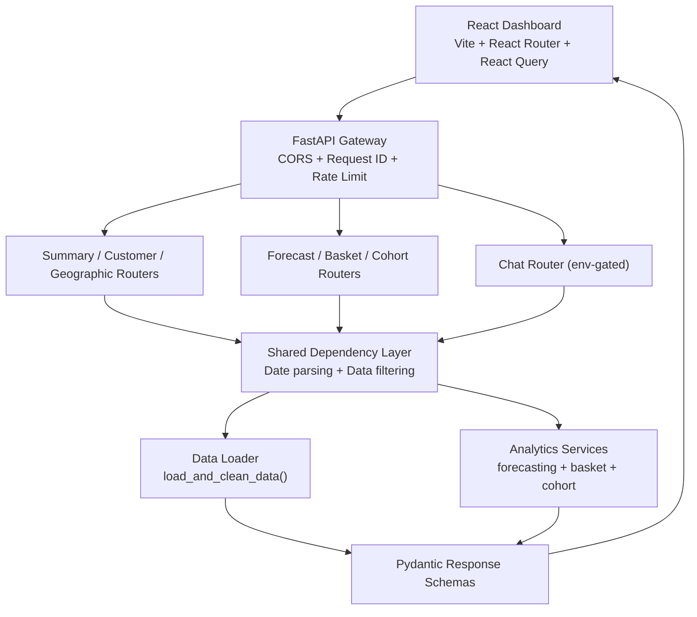

 # Ecommerce Analytics Platform - SRD and Build Plan

**Document Type:** Software Requirements Document (SRD) + Project Build Plan  
**State:** Pre-implementation blueprint  
**Writing Mode:** Future tense  
**Scope:** Backend API, Frontend Dashboard, Data/ML Analytics, AI Chat Assistant

## 1) Product Vision

The platform will provide a unified Business Intelligence workspace for ecommerce teams.  
It will transform transaction-level retail data into decision-ready insights across:

- Executive KPIs
- Customer segmentation
- Geographic performance
- Revenue forecasting
- Market basket analytics
- Cohort retention
- Natural-language analytics chat

The system will be designed so analytics modules are exposed through a FastAPI backend and consumed through a React dashboard with reusable UI components and route-based navigation.

## 2) Objectives and Success Criteria

### Functional objectives

- The platform will expose all analytics through typed REST endpoints.
- The frontend will provide module-level navigation and date-range filtering.
- The backend will preload and validate source data at startup.
- The chat assistant will run only in explicitly allowed trusted environments.

### Non-functional objectives

- API p95 latency (non-chat endpoints) will target under 800ms.
- Route-level loading states will render quickly and consistently.
- Responses will include request traceability using `x-request-id`.
- Errors will be returned in stable, user-safe JSON envelopes.

## 3) Planned Functional Scope

| Module | Capability (future state) | Primary API endpoint(s) | Frontend route |
|---|---|---|---|
| Executive Summary | Will provide total revenue, orders, customers, AOV, monthly trend, top products | `/summary/kpis`, `/summary/monthly-sales`, `/summary/top-products` | `/` |
| Customer Insights | Will compute RFM scores, segment distribution, and segment-level stats | `/customers/rfm-segments`, `/customers/segment-stats` | `/customers` |
| Geographic Analysis | Will provide country revenue map and top-country metrics | `/geographic/map`, `/geographic/top-countries` | `/geographic` |
| Forecasting | Will generate Holt-Winters forecast with configurable horizon and CSV export | `/forecast/generate`, `/forecast/export-csv` | `/forecast` |
| Market Basket | Will provide top products, affinity pairs, and basket summary stats | `/basket/summary` | `/basket` |
| Cohort Retention | Will provide cohort matrix and retention series | `/cohort/retention` | `/cohort` |
| AI Chat Assistant | Will answer natural-language questions over dataset (secure opt-in mode) | `/chat` (POST) | `/chat` |

## 4) Future Architecture

## 5) Data and Analytics Design

### Data ingestion and cleaning

The ingestion layer will:

- Validate required source columns before processing.
- Remove canceled invoices.
- Remove rows with non-positive quantity and price.
- Parse invoice dates to datetime.
- Derive `Revenue` and `YearMonth` fields for analytics.

### Analytical services

- **RFM service** will compute Recency/Frequency/Monetary and segment labels.
- **Forecast service** will use additive Holt-Winters (`seasonal_periods = 7`) and return historical + forecast series.
- **Basket service** will compute product association and transaction-level basket statistics.
- **Cohort service** will compute cohort matrix and period retention.

## 6) API Contract and Validation Rules

| Area | Requirement (future state) | Rule Type |
|---|---|---|
| Date parameters | Endpoints will accept optional `start_date` and `end_date` in `YYYY-MM-DD` | Validation |
| Date logic | `start_date > end_date` will return HTTP 422 | Validation |
| Data readiness | Missing loaded dataset will return HTTP 503 | Service readiness |
| Error model | Unhandled backend failures will map to stable 500 response envelope | Reliability |
| Request tracing | Middleware will set and echo `x-request-id` | Observability |
| Abuse control | High-cost routes will be rate-limited per-IP window | Security |

## 7) Security and Operational Controls

- Chat execution will be disabled by default.
- Chat execution will only run when `CHAT_ALLOW_DANGEROUS_CODE=true` in trusted local setups.
- Missing `GROQ_API_KEY` will produce an explicit 400 response.
- High-cost routes (`/chat`, `/forecast`, `/basket`) will be rate-limited.
- Logging will include request-scoped context for investigation.

## 8) Frontend Build Plan

The frontend implementation will deliver:

- Shared layout shell (sidebar, topbar, content frame)
- Route configuration for all analytics modules
- Reusable UI primitives (`Button`, `Card`, `Input`, `DataTable`, `KpiCard`, `EmptyState`)
- Date range filter controls
- Module pages for summary, customers, geographic, forecast, basket, cohort, and chat
- Request orchestration via React Query

## 9) Backend Build Plan

The backend implementation will deliver:

- FastAPI app bootstrap with lifespan-managed preload
- Shared dependency layer for date parsing and filtered dataframe access
- Router modules for all analytics features
- Typed schema responses with Pydantic
- TTL caching in selected routes for repeated query optimization
- Centralized exception handling and structured logging
- API tests covering core endpoint behavior and error conditions

## 10) Project Delivery Phases

| Phase | Timebox | Deliverables | Exit Criteria |
|---|---|---|---|
| P1 Foundation | Week 1 | Repo setup, dependency baseline, FastAPI shell, Vite shell, local run docs | Backend + frontend run locally; health endpoint passes |
| P2 Data Core | Week 1-2 | Data loader, cleaning contracts, filtering dependencies | Data validations and date filters pass with fixtures |
| P3 Analytics APIs | Week 2-3 | Summary, customer, geo, forecast, basket, cohort routers | Endpoint schemas and edge-case responses validated |
| P4 Frontend Experience | Week 3-4 | Layout, routes, module pages, charts/tables, empty/loading states | All routes render and consume live API data |
| P5 AI Assistant | Week 4 | Chat API + frontend UI, env gating, fallback behaviors | Chat works in secure opt-in local mode only |
| P6 Stabilization | Week 5 | Test hardening, performance pass, release notes, rollback checklist | Release candidate meets reliability and observability gates |

## 11) QA and Release Strategy

### Testing approach

- Unit tests will verify data transformations and service logic.
- API tests will verify endpoint contracts and error behavior.
- Frontend checks will verify route rendering, loading state, and empty state behavior.
- Build/lint/test pipeline will be required before release tagging.

### Release gates

- Reproducible local setup from clean environment.
- Required environment variables documented.
- Known limitations listed before release.
- Monitoring and rollback checklist completed.

## 12) Risks and Mitigations

| Risk | Impact | Mitigation | Owner |
|---|---|---|---|
| Source CSV schema drift | Loader failures and broken analytics | Enforce required-column checks and fixture-based regression tests | Data Engineering |
| Sparse or unstable time series | Forecast degradation | Controlled 422 fallback and UI fallback messaging | Analytics Engineering |
| Unsafe chat execution mode | Security exposure in non-trusted environments | Keep default deny; explicit environment gate and clear docs | Platform Owner |
| Burst traffic on heavy endpoints | Latency spikes | TTL cache + per-IP rate limits + route-level optimization | Backend Team |

## 13) Definition of Done (Project-Level)

The project will be considered implementation-complete when:

- All planned modules are live behind documented routes.
- Frontend routes are fully wired to backend contracts.
- API tests and frontend quality checks are passing.
- Core analytics outputs are validated against sample data.
- Security controls for chat and rate limiting are active.
- Release and support documentation are finalized.

---

If needed, this Markdown can be split into two standalone files next:
1. `ecommerce-srd.md`  
2. `ecommerce-build-plan.md`

1 - Product Vision and Objectives

### Strategic Outcome

The platform will provide a unified Business Intelligence workspace for
ecommerce teams. It will convert raw retail transactions into
decision-grade insights across executive KPIs, customer behavior,
geography, sales forecasting, market basket affinity, cohort retention,
and natural-language analytics chat.

- The system will expose all analytics via a FastAPI backend and a React
  web dashboard.
- The frontend will offer date-range filtering and route-based module
  navigation.
- The backend will standardize typed JSON responses with Pydantic
  schemas.
- The chat assistant will support secure opt-in pandas-agent analysis
  for trusted local environments.

2 - Functional Scope and Modules

| Module | Future Capability | Primary Endpoint(s) | Frontend Route | Delivery Status |
|----|----|----|----|----|
| Executive Summary | Will show total revenue, orders, customers, AOV, monthly trend, top products. | `/summary/kpis`, `/summary/monthly-sales`, `/summary/top-products` | `/` | Planned |
| Customer Insights | Will compute RFM scoring, segment distribution, scatter analysis, segment rollups. | `/customers/rfm-segments`, `/customers/segment-stats` | `/customers` | Planned |
| Geographic Analysis | Will provide country revenue map and top-country commerce metrics. | `/geographic/map`, `/geographic/top-countries` | `/geographic` | Planned |
| Forecasting | Will deliver Holt-Winters revenue forecast, historical alignment, and CSV export. | `/forecast/generate`, `/forecast/export-csv` | `/forecast` | Planned |
| Market Basket | Will compute top products, pair affinity, and basket-level summary statistics. | `/basket/summary` | `/basket` | Planned |
| Cohort Retention | Will calculate cohort matrix and month-over-month retention curves. | `/cohort/retention` | `/cohort` | Planned |
| AI Chat Assistant | Will answer dataset questions via guarded LLM + dataframe agent execution. | `/chat` (POST) | `/chat` | Controlled Enablement |

3 - Future Architecture and Runtime Flow

\+

\-

reset

flowchart TD A\["React Dashboard\
Vite + React Router + React Query"\] --\>
B\["FastAPI Gateway\
Request ID + CORS + Rate Limit"\] B --\>
C\["Summary / Customer / Geo Routers"\] B --\> D\["Forecast / Basket /
Cohort Routers"\] B --\> E\["Chat Router\
env-gated LLM mode"\] C --\> F\["Shared
Dependency Layer\
date parsing + app_state + filtering"\] D
--\> F E --\> F F --\> G\["Data Loader Service\
load_and_clean_data()"\] F --\> H\["Analytics
Services\
cohort + basket + forecasting"\] H --\>
I\["Typed Response Schemas\
Pydantic contracts"\] G --\> I I --\> A

### Platform Characteristics

- Startup lifecycle will preload dataset and precompute RFM baseline.
- All routers will consume a unified filtered dataframe dependency.
- Rate limiting will protect expensive routes: chat, forecast, basket.
- Short-lived in-memory TTL caches will reduce repeat query cost.

### Non-Functional Targets

- API p95 latency target will stay under 800ms for non-chat endpoints.
- Frontend route transition should render meaningful skeletons within
  200ms.
- All responses will include request traceability through
  `x-request-id`.
- Operational logs will emit structured context for errors and model
  failures.

4 - API Contract and Security Rules

| Area | Future Requirement | Rule Type |
|----|----|----|
| Date Filtering | All analytic endpoints will accept optional `start_date` and `end_date` in ISO format and will reject invalid or reversed ranges with HTTP 422. | Validation |
| Error Envelope | Unhandled failures will return a stable JSON envelope with a user-safe message, while internal details remain in logs. | Reliability |
| CORS Policy | Local dashboard origins will be allowlisted; deployment profile will move to explicit environment-driven origins. | Hardening |
| Chat Controls | Chat execution will remain disabled by default and will only run when `CHAT_ALLOW_DANGEROUS_CODE=true` in trusted local environments. | Security Gate |
| Rate Limits | Per-IP request buckets will throttle high-cost routes over a 60-second window and return HTTP 429 when exceeded. | Abuse Prevention |

5 - Data Engineering and Modeling Plan

### Data Pipeline Definition

The ingestion layer will validate required columns, remove
cancellations, remove non-positive sales, normalize invoice timestamps,
and derive reusable metrics including `Revenue` and `YearMonth`.

- Missing required schema columns will raise early pipeline failures.
- Customer-level aggregates will feed RFM and cohort computations.
- Time-contiguous daily series will be synthesized for forecasting
  stability.

### Forecasting and Analytical Services

The forecasting service will use additive Holt-Winters with weekly
seasonality and will return both historical and projected series to
support chart overlays and export workflows.

- Forecast horizon will be configurable between 7 and 90 days.
- Service-level runtime exceptions will map to deterministic HTTP 422
  errors.
- Basket and cohort services will be isolated for unit-level
  testability.

6 - Project Build Plan and Milestones

| Phase | Timebox | Build Deliverables | Exit Criteria |
|----|----|----|----|
| P1 Foundation | Week 1 | Repo scaffolding, dependency lock, FastAPI boot app, Vite shell, basic routing, environment templates. | Backend and frontend will run locally with health check and CI smoke pass. |
| P2 Data Core | Week 1-2 | Data loader, cleaning contracts, lifecycle preload, shared filter dependencies. | Data validations and date filters will pass with deterministic fixtures. |
| P3 Analytics APIs | Week 2-3 | Summary, customer, geographic, basket, cohort, forecast routers + schema models + cache layers. | All analytics endpoints will return schema-valid JSON and edge-case 422 responses. |
| P4 Frontend Experience | Week 3-4 | Dashboard layout, top bar, sidebar, reusable UI primitives, module pages, chart + table rendering. | All seven routes will show data-bound states, loading states, and empty states. |
| P5 AI Assistant | Week 4 | Chat route, guarded LLM integration, security flag gating, prompt boundaries, fallback behaviors. | Chat will remain opt-in and produce controlled answers against loaded dataframe only. |
| P6 Stabilization | Week 5 | End-to-end tests, performance pass, logging hardening, release docs, rollback checklist. | Release candidate will satisfy latency, reliability, and observability gates. |

7 - QA Strategy and Release Readiness

Test Strategy

The QA pipeline will include unit tests for data transformations and
services, API contract tests for every route, and frontend integration
tests for each dashboard page. A release will require a green run across
backend tests, frontend lint/build, and basic user-journey checks.

Release Gates

Release readiness will require reproducible local setup, documented
environment variables, migration-free startup, and validated fallback
behavior for missing chat credentials. Each release candidate will
include known limitations and explicit post-release monitoring
checkpoints.

8 - Risks, Dependencies, and Mitigations

| Risk Area | Future Risk | Mitigation Plan | Owner |
|----|----|----|----|
| Data Quality Drift | Incoming CSV structure may shift and break required-column assumptions. | Schema assertions and synthetic fixtures will be maintained for regression protection. | Data Engineering |
| Forecast Fragility | Sparse date ranges may degrade smoothing model stability. | Service will return controlled 422 errors and fallback messaging in UI. | Analytics Engineering |
| Chat Security | Dangerous code execution mode may expose local environment risk. | Default-deny policy with explicit environment flag and trusted-only documentation. | Platform Owner |
| Performance | Repeated heavy computations may raise latency under burst traffic. | TTL caching, route-level throttling, and lazy chart fetching will be implemented. | Backend Team |

